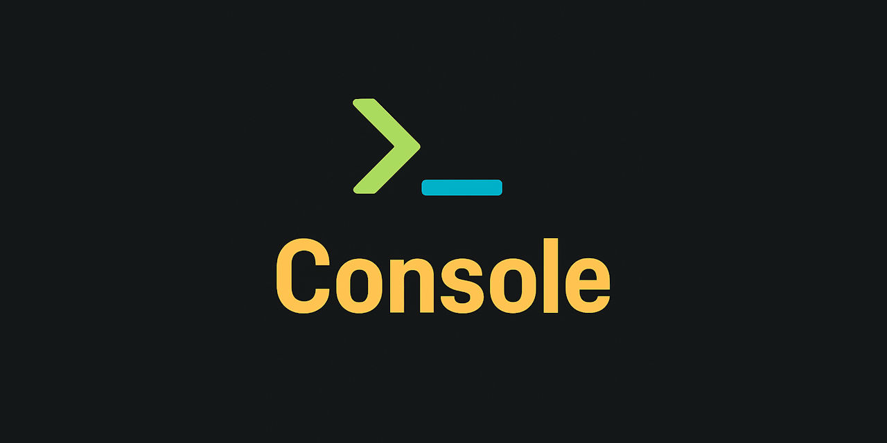

  
[](https://discord.gg/tPWjMwK)
[](https://bsky.app/profile/tinybiggames.com)    

# 🖥️ Console

**Console** is a powerful static class that brings modern terminal capabilities to your Delphi Win32 console applications. From vibrant ANSI text formatting to precise cursor control and interactive input handling, it gives your apps a professional polish — all with zero dependencies and written entirely in Pascal.

> ✨ Print. 🎞️ Animate. 🎮 Control.  
> All in pure 🐘 Delphi.

## 🚀 Features

- 🎨 **ANSI Styling** – Set foreground/background colors, RGB or named, and bold text
- 🖋️ **Formatted Output** – Print and PrintLn support standard arguments and text wrapping
- ⌨️ **Input Handling** – Detect key presses/releases, read individual keys or typed input
- 📺 **Cursor Management** – Move, show/hide, save/restore, and query cursor position
- 🧼 **Screen Control** – Clear screen, lines, or portions of a line with color support
- 🎬 **Teletype Simulation** – Animate output character-by-character with dynamic delays
- 🎲 **Utility Methods** – Random values, terminal title management, safe delays, and more
- 🧪 **Delphi IDE-aware** – Automatically adapts when run inside the Delphi IDE

## 📦 Usage

```pascal
uses Console;

begin
  TConsole.Init('My Console', POS_CENTER, POS_CENTER, 110, 30, 20);
  try
    TConsole.ClearScreen();
    TConsole.SetTitle('Demo');
    TConsole.PrintLn('Welcome to Console!');
    TConsole.Teletype(CSIFGGreen+'Simulated output... one char at a time.');
    TConsole.WaitForAnyKey();
  except
    TConsole.Shutdown();
  end;
end.
```

## 🧱 API Overview

### 🖨 Output
- `Print`, `PrintLn` – With or without arguments
- `Teletype` – Simulate typewriter-style printing
- `WrapTextEx` – Word-wrap long text intelligently

### 🎨 Styling
- `SetForegroundColor`, `SetBackgroundColor` – Named ANSI colors
- `SetForegroundRGB`, `SetBackgroundRGB` – Full RGB color support
- `SetBoldText`, `ResetTextFormat` – Styling control

### 🎯 Cursor
- `SetCursorPos`, `GetCursorPos` – Move or retrieve cursor position
- `MoveCursorUp/Down/Forward/Back` – Relative movement
- `SaveCursorPos`, `RestoreCursorPos`
- `ShowCursor`, `HideCursor`, `SetCursorVisible`

### 🧼 Screen
- `ClearScreen`, `ClearLine`, `ClearToEndOfLine`
- `ClearLineFromCursor` – In color!

### ⌨️ Input
- `ReadKey`, `ReadLnX` – Get typed characters
- `WaitForAnyKey`, `AnyKeyPressed`
- `IsKeyPressed`, `WasKeyPressed`, `WasKeyReleased`
- `ClearKeyStates`, `ClearKeyboardBuffer`

### 🛠 Utilities
- `SetTitle`, `GetTitle`
- `GetSize` – Terminal width and height
- `Pause` – Print a pause message and wait
- `Wait` – Delay in milliseconds
- `RandomBool`, `RandomRange`

### 🧠 Environment-Aware
- `HasOutput` – Detect if console has valid output stream
- `WasRunFrom`, `IsStartedFromDelphiIDE` – Detect development environment

## 📋 Requirements

- Should work with any Delphi version with Unicode support.
- **Windows 10+ Console** with ANSI support (Virtual Terminal Sequences)
- Developed and tested using **Delphi 12.3**, Windows 11 (64 bits)

## 📁 Project Structure

- `Console.pas` – Main unit (pure static class)
- No dependencies, no DLLs, no third-party units — just drop it in and go.

## 🖼️ Media
**Console demos**

[](https://www.youtube.com/watch?v=5NAvbLvyK28)  
<small>*click image to [open video](https://www.youtube.com/watch?v=5NAvbLvyK28)*</small>


> 🚧️ **This repository is currently under construction.**
>  
> Console is actively being developed. Features, APIs, and internal structure are subject to change.  
>  
> Contributions, feedback, and issue reports are welcome as the project evolves.


## 🛠️ Support and Resources

- 🐞 **Report issues** via the [Issue Tracker](https://github.com/tinyBigGAMES/Console/issues).
- 💬 **Engage in discussions** on the [Forum](https://github.com/tinyBigGAMES/Console/discussions) and [Discord](https://discord.gg/tPWjMwK).
- 📚 **Learn more** at [Learn Delphi](https://learndelphi.org).

## 🤝 Contributing  

Contributions to **✨ Console** are highly encouraged! 🌟  
- 🐛 **Report Issues:** Submit issues if you encounter bugs or need help.  
- 💡 **Suggest Features:** Share your ideas to make **Console** even better.  
- 🔧 **Create Pull Requests:** Help expand the capabilities and robustness of the library.  

Your contributions make a difference! 🙌✨

#### Contributors 👥🤝
<br/>

<a href="https://github.com/tinyBigGAMES/Console/graphs/contributors">
  
</a>

## 📜 Licensing

**Console** is distributed under the **🆓 BSD-3-Clause License**, allowing for redistribution and use in both source and binary forms, with or without modification, under specific conditions.  
See the [📜 LICENSE](https://github.com/tinyBigGAMES/Console?tab=BSD-3-Clause-1-ov-file#BSD-3-Clause-1-ov-file) file for more details.

---

🖥️ Console — Modern Console Power for Delphi. ✨ Print. 🎞️ Animate. 🎮 Control. All in pure 🐘 Pascal.

<p align="center">

</p>
<h5 align="center">
  
Made with ❤️ in Delphi  